[toc]

# 0. 序言

又又又重新学习Unity了. 哎, 自己的记性就是不好, 老得重来. 这次跟着Brackeys大神的课程来学习. 这是他两年前的视频了.

[【Brackeys】unity入门教程合集_哔哩哔哩_bilibili](https://www.bilibili.com/video/BV1nL411H78w/?vd_source=234760f1645b7943d3b57ca98473a778)

学习的是**P1-P13**


# 1. 玩法简介

玩家控制一个cube左右移动, 在cube持续前进的过程中躲避障碍物到达中点则胜利.


# 2. 快捷操作

## 2.1 ctrl移动GO, 按指定量位移

按住**ctrl移动GameObject**, GameObject的位置会根据指定值为最小单位增加或减少.

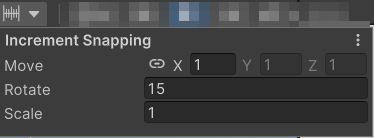


## 2.2 ctrl + \ 网格对齐

选中某个GO, 按住ctrl + \可以将GO中心点对齐到最近的网格上

也可以使用左上角工具, 选择对齐的轴和网格大小

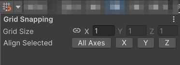


## 2.3 shift + 空格 最大化窗口

focus on Scene或者Game窗口, 点击shift和空格可以最大化窗口


## 2.4 ctrl + p 开启Play模式


## 2.5 shift + ctrl + f 将GO移动到当前视角位置

这个技巧可以很好的调整**相机的位置和朝向**


# 3. 其它技巧

## 3.1 禁用或隐藏layer

就像tag一样, 我们可以给不同物体标记一个**layer**, 然后通过Unity右上角的Layers下拉框同一对不同layer做统一操作. 包括隐藏和不能选中

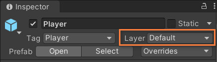

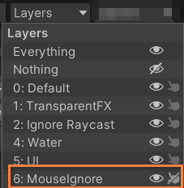

这对于防止总是点地板很有用处.


## 3.2 Range, Space, Header特性

```c#
    [Header("Force")]
    [Range(50f, 150f)]
    [SerializeField] float sideForce = 80f;

    [Space]

    [SerializeField] float forwardForce = 4000f;
```

效果图, 在Unity编辑器中

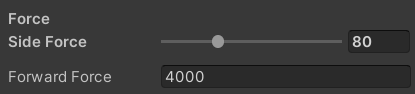


## 3.3 修改playmode下的背景

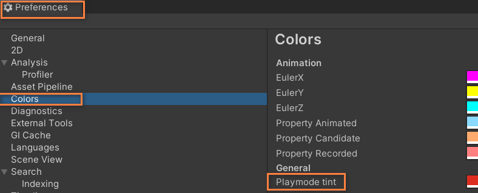

这样做是**避免在play模式下修改GO状态**, 但是忘了保存, 因为play模式的修改默认是会丢弃的. 修改为红色, 进入playmode, Unity编辑器背景将会变得一片红.


## 3.4 使用Debug模式查看所有私有变量

选中inspector下的Debug选项

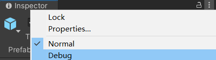


# 4. Update, FixUpdate, LateUpdate

一般, 物理更新实在FixUpdate进行的, 它能让**物体运动更新得更平滑**. 但FixedUpdate也有自己的问题, 那就是**对输入获取不灵敏, 因为它是固定时间更新的**

一种好的做法是, 在**Update里获取用户输入, 在FixUpdate才根据输入更新位置**

```c#
void Update()
{
  h = Input.GetAxisRaw("Horizontal");
}

void FixedUpdate() {
  __MoveHorizontal(h);
  __MoveForward();
}

void __MoveHorizontal(float h) {
  float sideForceInstant = h * sideForce * Time.deltaTime;
  rb.AddForce(sideForceInstant, 0, 0, ForceMode.VelocityChange);
}

void __MoveForward() {
  rb.AddForce(0, 0, forwardForce * Time.deltaTime);
}
```

而摄像机位置的更新使用LateUpdate就好

## 4.1 修改FixUpdate的固定更新频率

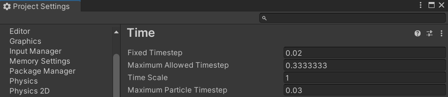


# 5. 动画录制功能使用

如果一个GO具有animator组件，animator组件下有animController, animController下有对应的animClip. 那么它就能够使用录制功能来录制简单动画

红色按钮是录制， 另外一个是动画事件

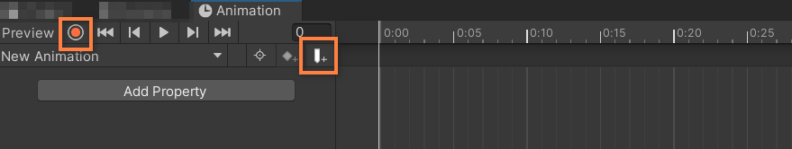

**只要在录制状态下, 改变GO的属性, 这些改变属性的最终值会被记录为一个关键帧**, 这种方式比逐一点击增加属性效率高多了.

还能够在任何时间线上添加事件, 动画执行到指定时间就会自动触发,注意这个**事件所在的脚本必须在animator组件所在的GO上**.


# 6. GameManager

对于小型或中性游戏, 有一个GameManager脚本用来管理**游戏的开始, 退出等逻辑是很有用的**.

brackeys的做法是**让其它脚本获取GameManager, 在需要的地方调用GameManager的方法**. 我记得**自己写GameManager, 有让GameManager持有并操作其它非必须脚本的习惯**

```c#
using UnityEditor;
using UnityEngine;
using UnityEngine.SceneManagement;

public class GameManager : MonoBehaviour
{
    public PlayerMovement playerMovement;
    public Animator completeLevelAnimator;
    public float restartDelay = 1.0f;

    bool isGameOver = false;

    public void EndGame() {
        if (!isGameOver) {
            isGameOver = true;

            playerMovement.enabled = false;

            Invoke(nameof(__Restart), restartDelay);  // use nameof keyword is better.
            //Debug.Log("Game over!!!");
        }
    }

    public void Quit() {
#if UNITY_EDITOR
        // EditorApplication.Exit(0); // close unity editor.
        EditorApplication.ExitPlaymode();

#else
        Application.Quit();
#endif
        Debug.Log("游戏退出!");
    }

    public void CompleteLevel() {
        completeLevelAnimator.SetBool("CompleteLevel", true);
    }

    public void StartGame() {
        SceneManager.LoadScene(SceneManager.GetActiveScene().buildIndex + 1);
    }

    private void __Restart() {
        if (isGameOver) {
            SceneManager.LoadScene(SceneManager.GetActiveScene().name);
        }
    }
}
```

上面还是用了**条件编译**

顺便说一下, 根据单一职责原则, 每个类的功能还是单一点比较好.


# 7. 切换场景的灯光问题

简单的说, **切换场景不允许Unity有足够时间对新场景的灯光进行计算**和场景渲染, 所以总会出现光线异常.

解决方法是在Lighting选项中提前生成光照贴图

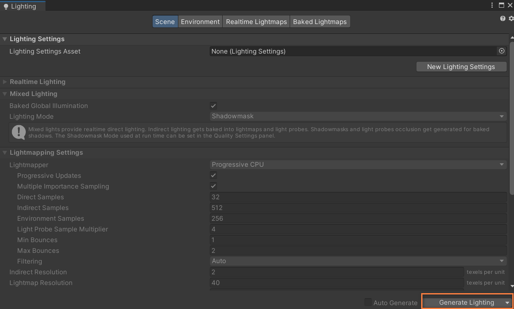

因为是使用CPU渲染, 所以速度很慢.


# 8. 打包工具使用

网址[Inno Setup Downloads (jrsoftware.org)](https://jrsoftware.org/isdl.php)

这个工具能将exe等文件打包成install.exe脚本安装工具.

需要注意的是在**添加目录过程中必须给指定目录套个顶层目录**

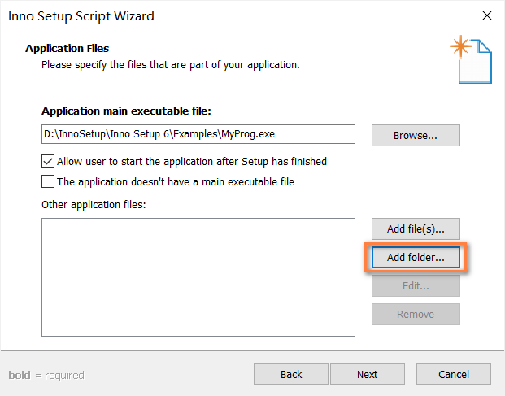

目标目录

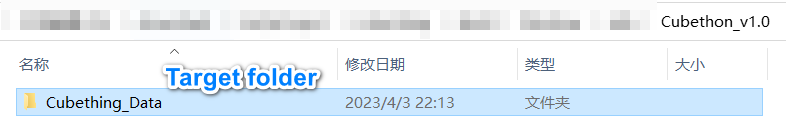

修改后目录

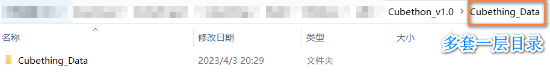