[toc]

# 0. 序言

> * 这次记录navmesh的使用, 对应brackeys视频的28p
>
> * NavMeshComponents的Gitbub地址: [Unity-Technologies/NavMeshComponents: High Level API Components for Runtime NavMesh Building (github.com)](https://github.com/Unity-Technologies/NavMeshComponents)


# 1. NavmeshStatic

如果使用Unity自带的Navmesh组件, 需要**提前拷贝导航网格, 并且只有被标记为NavmeshStatic的GO对导航网格生成有贡献**

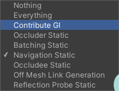


# 2. 使用NavMeshComponents

使用NavmeshComponents能打破许多限制, 比如不要求NavmeshStatic标记

## 2.1 NavmeshSurface组件

给需要生成导航网格的表面GO添加NavmeshSurface脚本组件

**谨记, 需要在NavmeshSurface脚本下点击拷贝导航网格, 不要使用Window->AI下的Navigation**

## 2.2 NavmeshModifier对个别障碍物进行修改

使用NavmeshSurface生成的导航网格可能在不想要的地方可行走

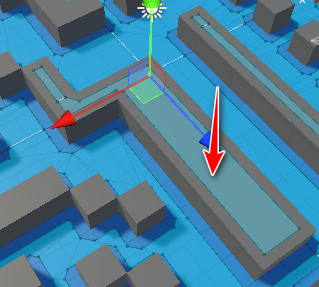

使用NavmeshModifier来个别修改它

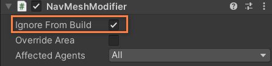


## 2.3 NavmeshObstacle组件

NavmeshObstacle配合NavmeshSurface, 实现**导航网格部分动态**. 

下图中, 4个障碍物是可以移动的, 如果只是静态拷贝, 那么在障碍物移动后, 导航网格不会同步更新

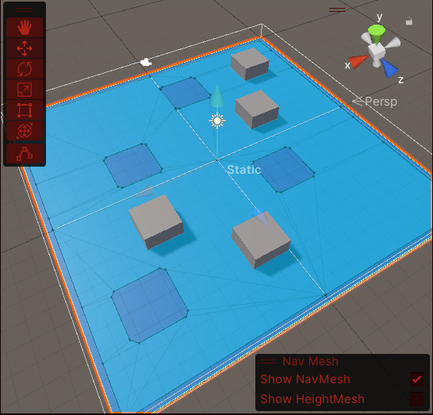

给四个障碍物添加**NavmeshObstacle组件**, 并且勾选**Carve**选项, 同时取消**CarveOnlyStationa**

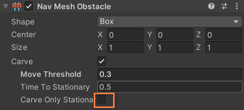

导航网格会实现实时更新

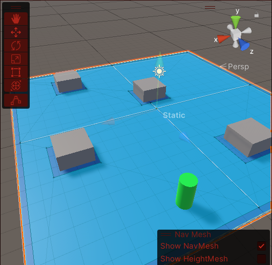

但这样异常消耗性能, 推荐还是不使用Carve, 而是**直接使用NavmeshObstacle**

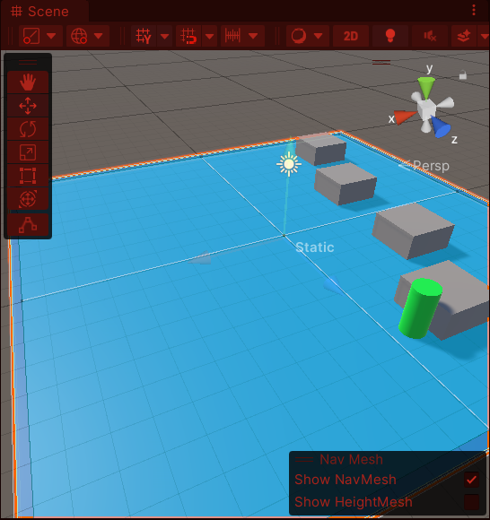

NavmeshAgent是会尝试到达障碍物下的位置, 只是**障碍物像有斥力一样推开Agent**, 加了一层约束.

## 2.4 NavmeshVolumn组件制作空气墙

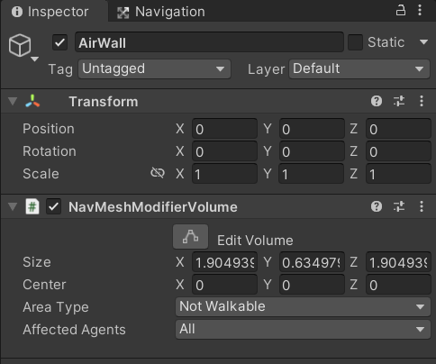

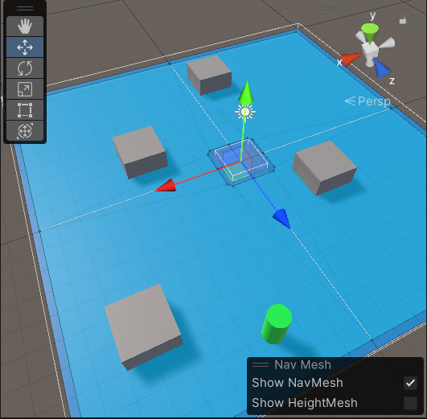


## 2.5 NavmeshLink组件

Unity自带的OffMeshLink组件并不好用, 推荐使用NavmeshLink, 它带有可视化的编辑器

NavmeshLink用于**链接不直接相连的导航网格**.另外，这个链接似乎只适合静态物体上的静态导航网格。

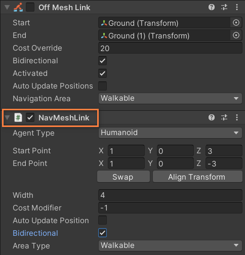

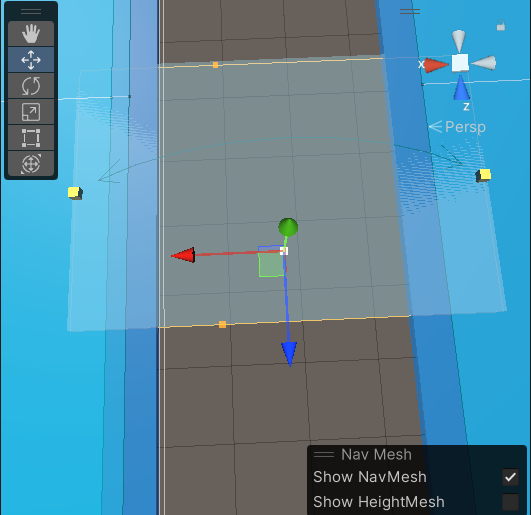

* CostModifier属性: 行走花费, 高值意味着Agent行走的慢.
* AutoUpdatePosition属性: 意思好像是endPoint位置改变时, 自动链接所在位置的Navmesh


# 3. 运行时生成导航网格

对于运行时才确定的地形, 需要在运行时动态的生成导航网格. 很简单就能做到, 只需要获取到NavmeshSurface组件, 调用**BuildNavMesh**

```c#
surface.BuildNavMesh();
```


# 4. 对Agent和Collider的区分和理解

第三人称的标准资源我在Unity上找不到了, 就在Brackeys视频下链接找到了

**Agent和Collider是区分开的**

```c#
using UnityEngine;
using UnityEngine.AI;
using UnityStandardAssets.Characters.ThirdPerson;

public class ArriveDestination : MonoBehaviour
{
    public ThirdPersonCharacter character;
    public NavMeshAgent agent;

    private void Start() {
        agent.updateRotation = false;
    }

    void Update()
    {
        GetDesitinationByMouse();
    }

    void GetDesitinationByMouse() {
        if (Input.GetMouseButton(0)) {
            Ray ray = Camera.main.ScreenPointToRay(Input.mousePosition);
            
            if (Physics.Raycast(ray, out RaycastHit hit)) {
                ArriveAtDestination(hit.point);
            }
        }

        if (agent.remainingDistance > agent.stoppingDistance) {
            character.Move(agent.desiredVelocity, false, false);
        }
        else {
            character.Move(Vector3.zero, false, false);
        }
    }

    // In order to make anim change. Use ThirdPersonCharacter to control character rather then agent
    void ArriveAtDestination(Vector3 position) {
        agent.SetDestination(position);
    }
}
```

这是我复刻的代码, 当你添加agent.updatePosition = false. **你会发现代理和碰撞器分开了**

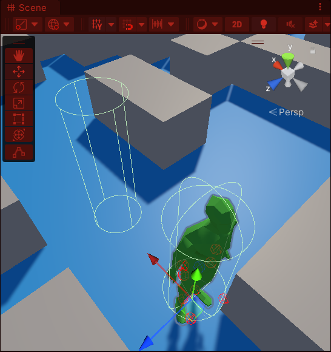

这是因为有时候除了Agent本身控制位移发生变化, 其它组件也会控制位置发生变化, 比如Rigidbody. agent.updatePosition的作用就是更新代理位置为Transform的位置. 可见, 原本Agent控制的就是Agent的位置.

**使用Agent.desiredVelocity和agent.updatePosition为true**来确定任何时刻到达终点要走的方向