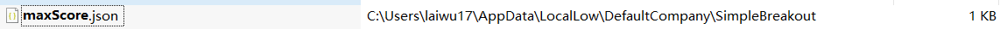

[toc]

# 0. 序言

介绍两种在Unity保存持久数据的方式


# 1. PlayerPrefs存取数据

PlayerPrefs存取数据十分方便, **它很像饥荒里的数据存储方式**

```c#
highScore = PlayerPrefs.GetInt("highScore", 0);
```

第二个值是当数据不存在时, 获取的默认值

```c#
PlayerPrefs.SetInt("highScore", currentScore);
```

删除数据用

```c#
PlayerPrefs.DeleteKey("highScore");
```

```c#
PlayerPrefs.Save();
```

看来PlayerPrefs还是一种缓冲存储的方式, 这样性能更高


# 2. 使用Json文件

```c#
public MaxSocre LoadMaxScoreInfo() {
  // important
  string path = Application.persistentDataPath + "\\maxScore.json";
  if (File.Exists(path)) {
    string jsonStr = File.ReadAllText(path);

    return JsonUtility.FromJson<MaxSocre>(jsonStr);
  }
  return null;
}
```

```c#
public MaxSocre SaveMaxScoreInfo() {
  MaxSocre maxSocre = new MaxSocre();
  maxSocre.maxScore = m_Points;
  maxSocre.name = playerName;

  string jsonStr = JsonUtility.ToJson(maxSocre);
  // async.
  File.WriteAllTextAsync(Application.persistentDataPath + "\\maxScore.json", jsonStr);
  return maxSocre;
}
```

默认路径


