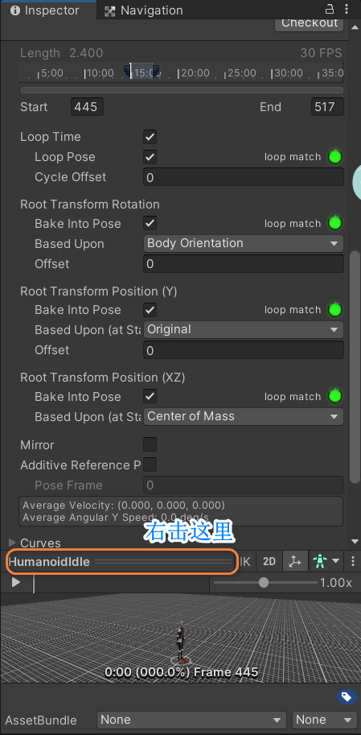

[toc]

# 0. 序言

记录了brackeys分享的一些实用技巧

# 1. 双击f跟踪移动物体

点击f是zoom out静态物体; 而双击f可以在物体移动时保持跟踪

# 2. \#region划分代码块

划分后的代码块支持合并操作, 可以更好规划代码

```c#
#region PointMouse //块名称
  
#endregion
```

# 3. [Tooltip("Description")]特性, 可以在Unity编辑器中给出属性描述

对复杂的属性最好添加描述

# 4. 右键放大,更好观察模型或动画



# 5. 在hierarchy窗口下按住Alt, 点击展开. 能够同时展开当前对象所有子对象

