[toc]

# 0. 序言

普通的tilemap创建的场景都是规规整整的, SpriteShape允许创建**有弧度的精灵**

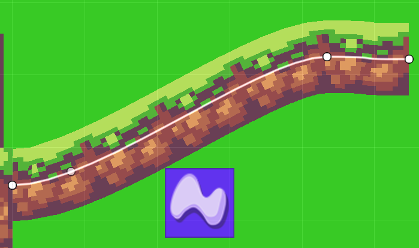

# 1. 创建SpriteShape精灵

首先要在project窗口下创建SpriteShape profile文件来配置tile

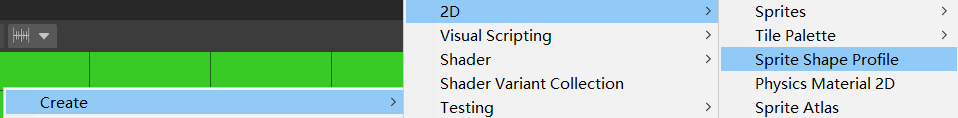

然后就可以在hierarchy窗口创建SpriteShape精灵了

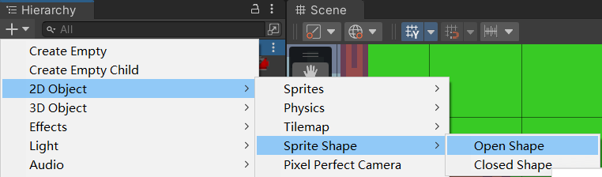

为SpriteShape精灵分配profile后，就可以配置SpriteShape了。配置包括**曲线形状**，**拼接模式**，**是否闭环**等

# 2. 添加碰撞体

为SpriteShape精灵的不规则形状分配collide请使用**edge collide 2d**组件

# 3. 创建一个闭合墙体

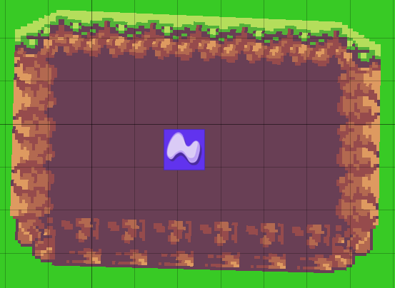

## 3.1 关闭SpriteShape精灵的open end选项

## 3.2 在profile文件为不同方向分配不同tile

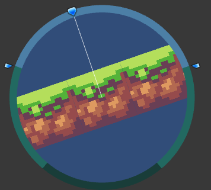

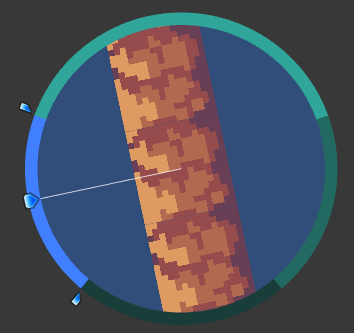

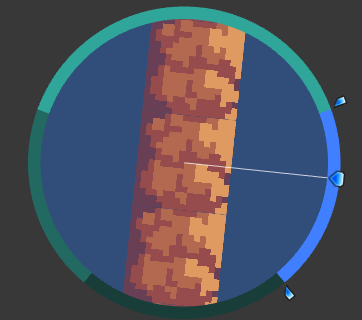

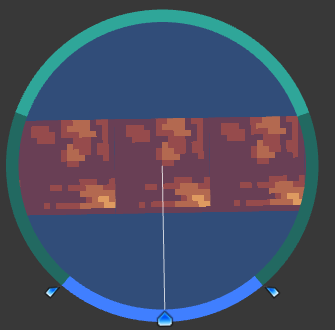

## 3.3 在精灵那记得修改拼接模式为linear, 这样才会有不同方向的不同精灵展示

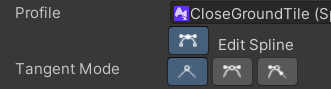

## 3.4 添加填充物

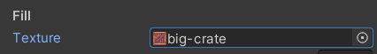

## 3.5 修复边角,为边角分配图片

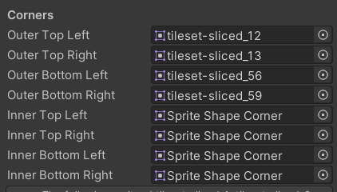