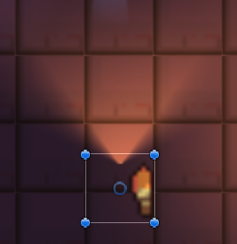
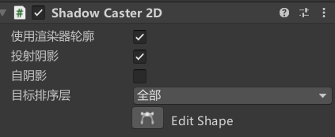
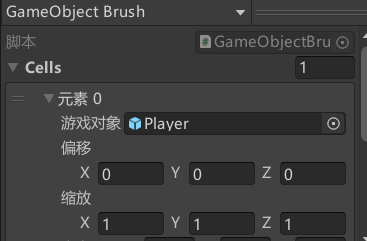

[toc]

## 0. 序言

跟着brackey大神使用了一下unity  2D的灯光，特别需要注意的点是必须使用unity **URP渲染管道**。

## 1. 使用2D灯光

想要使用2D灯光只需要在hierarchy口窗口右键选择灯光。

能够使用的灯光类型还是很多的。比如sprite灯光，点灯光，可变形状的灯光。

其中点灯光的属性需要留意包括outer光半径， inner光半径，比较难理解的是inner angle角度和outer angle角度。利用这两个属性可以实现将点光源变为**锥形光**。看来可以实现手电筒效果。

## 2. 实现2D阴影

想要应用2D阴影，必须在要产生阴影的物体上挂载ShadowCaster2D脚本。

## 3. Tilemap使用GameObject笔刷

使用默认笔刷创建的精灵是无法挂载任何脚本的，想要简单的创建多个重复对象，可以使用对象笔刷。对象笔刷创建的任何一个对象是可以挂载脚本的。只不过想要切换不同的对象比较麻烦，并且不能将对象放到笔刷涂料板中。

