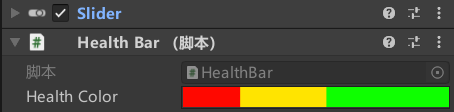
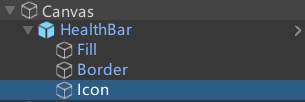
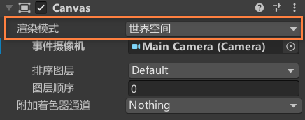
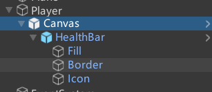
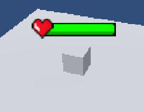

[TOC]

## 0. 序言

依旧是跟着brackey大神学习如何创建**血量条**UI组件

基本的实现原理是通过使用slider的UI组件。它不仅可以实现血量条，也可以用类似的实现**技能冷却条**。

## 1. 实现

基本的实现就不一一列出来，重要的是如何将血量条**放置到世界空间**中，而不是UI界面中。实现方法是修改血量条所在**Canvas的render mode**。

这样血量条就可以视为WorldSpace中的一个game object对象了，之后就是解决如何让血血量条始终**在相机中看来是正对的**。实现思路是始终让UI血量条面对的方向和摄像机的朝向保持一致。

注意正方形在3D空间中

代码是通过LookAt实现的。