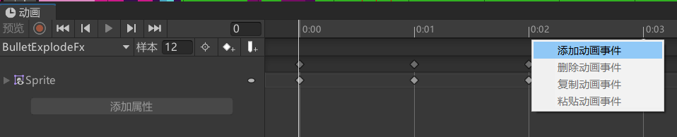

[toc]

# 0. 序言

基本上游戏射击的实现方式有两种。

一种是通过**碰撞检测**这种方式适合子弹速度比较慢，并且希望玩家能看到子弹的场景。

另外一种方式是**使用射线**，这种方式适合子弹速度比较快的场景。

# 1. 碰撞检测

碰撞检测的缺点是当子弹速度比较快时，可能会发生碰撞丢失的情况，具体的表现为子弹穿过某一个碰撞器，但碰撞事件并没有被触发。将rigidbody中的检测选项改为**连续**能减少这种情况的发生，但依旧会有穿模问题。使用碰撞检测的方法，需要创建子弹的prefix。

# 2. 射线

使用射线的优缺点是玩家无法再看到子弹了。

# 3. 动画事件

另外提一下，可以在任何的动画切片即animation的任何时段**创建触发事件**，只要动画播放到指定的时段，事件就会自动触发。通常情况下，会在动画的结束阶段添加合适的时间。另外，可以绑定的事件处理方法只能是**自定义脚本中的公有方法**。并且绑定时动画所在的游戏对象必须**在层级窗口中，而不能是prefab**。

比如，我为子弹创建了一个爆炸FX，这个FX会在动画播放结束后自动销毁，就是通过动画事件来实现。就不需要使用destroy的销毁前摇了。

而使用射线的方法，我创建了一个**LineRender**件来创建一个类似激光的效果。

需要注意的，我曾尝试使用动画事件来控制子弹发射的频率，这种方式并不太好，因为当有多个动画涉及子弹的发射时他们都需要被更改。所以还是老老实实用代码来限制子弹的发射频率。我的实现是，玩家点按和持续按下共用一个计时器，玩家点按成功时立刻发射一枚子弹，持续按下按间隔发送。

另外我实现了一个受伤时候的频闪特效，就是通过迭代器语法来简单修改alpha实现。