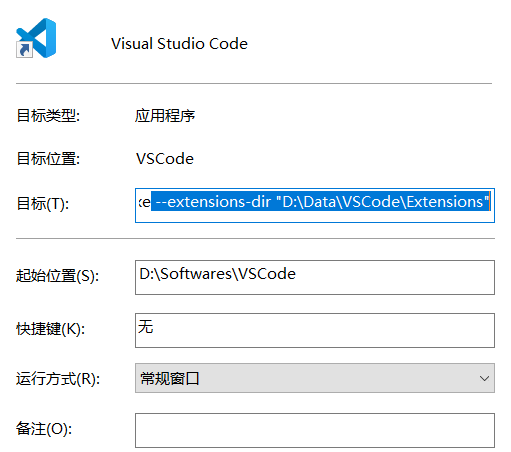
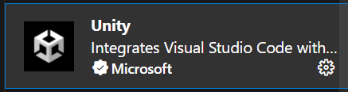
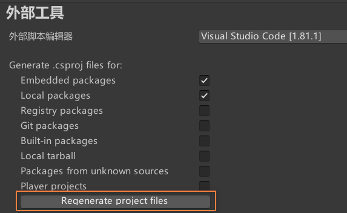
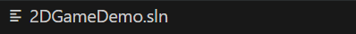

[toc]

# 0. 序言

# 1. 修改扩展存储路径

VSCode插件的默认存储路径在。

<u>C:\Users\UserName\\.vscode\extensions</u>

VSCode无法在软件内部或是修改配置文件来改变插件存储路径（至少没找到有效做法）

**网上做法是在启动路径上添加命令参数**，右键快捷方式，再点击属性，在目标中添加

--extensions-dir 参数。

但这样依旧有问题。就是直接通过文件打开，VSCode不会加载目标插件。

解决方法是通过修改**注册表**。

*请参考这篇文章*

[鼠标右键打开 VSCode 设置（Open With VSCode）_点击右键 vscode 设置_@memory的博客-CSDN博客](https://blog.csdn.net/weixin_47638941/article/details/120781121)

通过这篇文章，你能知道window中的页面选项是根据注册表设置的（当然功能肯定更多）。

记得加上--extensions-dir参数。

# 2. 安装AWS的AI编码辅助

在VSCode的扩展项中搜索AWS，CodeWhisperer是AWS的一个插件。需要登录AWS账号才能使用CodeWhisperer。

注册的流程比较简单，标准的邮箱注册。唯一需要注意的是**首次进入web界面时，要求输入一个VSCode的Build Id。Build Id此时已经复制好了，直接Copy就好（不然你找不到的）**。

**快捷命令**

左右方向键：更换代码建议

ESC键：拒绝代码建议

Alt+C键：刷新代码建议

# 3. 使VSCode支持Unity Debug和代码补全

Debug需要VSCode安装一个插件

使用方法在插件中有说明。

需要注意版本问题。

**代码补全**

注意点，VSCode要正确打开项目所在的根目录

可以尝试重新生成C#项目

在Unity的Preference中点击Regenerate project files

再不行就尝试删除sln项目文件

最好先打开VSCode，再通过Unity点击Script进入。
