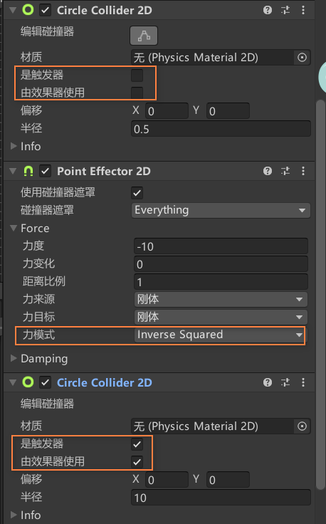

[toc]

# 0. 序言

下面介绍的2D Effector可以改变Collider的行为。

# 1. Surface Effector

Surface Effector绑定的Collider可以使其它接触的Collider具有速度。

注意其中的"使用恒力"，作用其实是修改力的作用点。默认是施加到中心点，勾选后为施加到触摸点，这可能导致旋转。

#  2. Point Effector

点效应器作用比较有趣，它可以使目标带有"引力"或是"斥力"。

通常，需要使用一个额外的触发器Collider来表示力的作用范围。

其中，力模式表示力大小的计算方式，如上选择表示牛顿定理。

# 3. Area Effector

Area Effector可以使用一个触发器，来创建一个施加力的区域。

力角度可以决定施加力的方向，默认是X轴正方向。建议勾选全局角，因为旋转会改变自身X轴方向。

Area Effector可以用于创建吹风区域。

# 4. Buoyancy Effector

Buoyancy Effector非常适合流体，它能实现物体漂浮的效果。

具体参数不展开了，都比较容易理解。

# 5. Platform Effector

用于制作平台，实现单向穿过。

侧向摩擦和反弹。对于具有摩擦和反弹的表面。默认是正面才有效果，两边是不起作用的。

