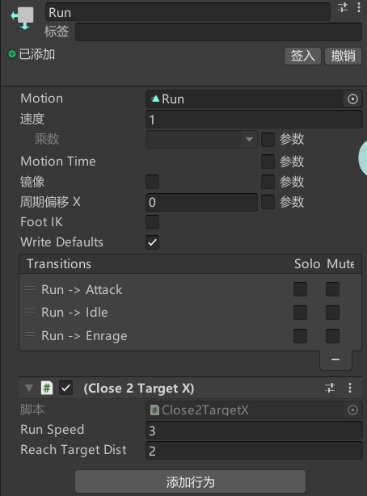
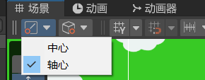
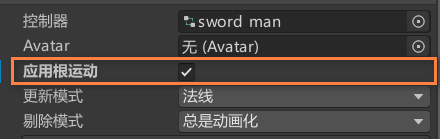

[toc]

# 0. 序言

StateMachine可以很好的处理gameobject的状态。比如，一个Boss可以有多个阶段，每个阶段有不同行为。

就可以在StateMachine中实现。

# 1. 在state machine添加行为




# 2. 获取behavior脚本

```C#
targetGO = animator.GetBehaviour<FindTarget>()
```


# 3. 制作Demo时的收获

## 3.1 改变坐标轴锚点

导入的模型，其坐标轴是固定的。有时位置很不理想，会非常影响旋转的效果。

可以通过Scene窗口左上角的锚点工具来修改为中心解决。



中心：Unity根据选择的多个物体，自动计算轴的中心位置。

有时候中心模式也不能很好解决问题，这时候试着用下面博客的方法来解决吧。

[unity更改模型的坐标轴位置_unity重新定位坐标轴_萤火虫 ✨的博客-CSDN博客](https://blog.csdn.net/qq_43749617/article/details/107983743)


## 3.2 注意不要修改animator载体的旋转

由于动画是修改的子物体的属性，包括位置，缩放，旋转等。

所以外部最好不要修改这些子物体的位置，缩放和旋转属性。以免影响动画。

也不要修改它们最直接的父节点。


想要旋转它，可以再添加更多的空父节点。

另外，有时候不能控制animator所在的物体。可以尝试修改animator的**root motion**。



这个选项具体功能还未知。


## 3.3 其它收获

* 修改了brackey 2D角色移动脚本的bug。

```C#
m_Rigidbody2D.velocity = new Vector2(m_Rigidbody2D.velocity.x, 0);
```

* 添加了多段跳功能
* 实现一个阀门Valve脚本
* 实现一个InputExtension脚本，如果忘记扩展语法，看这个脚本。

>这个脚本是通过C#的扩展语法实现的，但它限制调用这必须是实例，是无法为静态类或非静态类扩展“静态方法的”。所以参考了一个博客的做法。使用空对象来实现。
>
>[关于C#：我可以向现有的静态类添加扩展方法吗？ | 码农家园 (codenong.com)](https://www.codenong.com/249222/)
>
>语法是：**(null as T).Method()**; 
>
>**另外new T()很慢**。

* 实现了一个EventListener脚本，使用反射来注册事件。了解到很多反射知识，如果忘记了可以看代码。