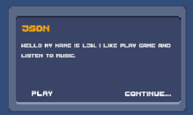

[toc]

# 0. 序言

跟着brackey大神制作的一个简单的对话系统。

# 1. 功能

制作了一个简单的对话系统，实现了基本的功能：

一，实现语句的自动播放和暂停；

二，实现了手动的点击下一句的功能；

三，展示一个句子有两种方式：一种方式是瞬间的展示；另一种方式是**每个字母逐帧**的展示。

实现思路是：

> 创建一个包括名字和多个语句的结构体--段落。一段对话是由多个段落组成的，这些段落可以来自于不同的对象。 
>
> 自己实现的这个system非常简单，在brackey大神的视频中，有一个更完善的对话系统，这个对话系统支持玩家加入并选择分支对话。还能领取任务。
>
> 它通过树形结构来实现，每个对话都有一个唯一的ID，并且可以具有分支，这个分支供玩家选择。
>
> 每个分支指向另一个唯一的对话。

# 2. 收获

放播放暂停的功能实现主要依靠于**Invoke**和**CancelInvoke**这两个函数。

没有新知识点，就是日常代码，具体请看代码。