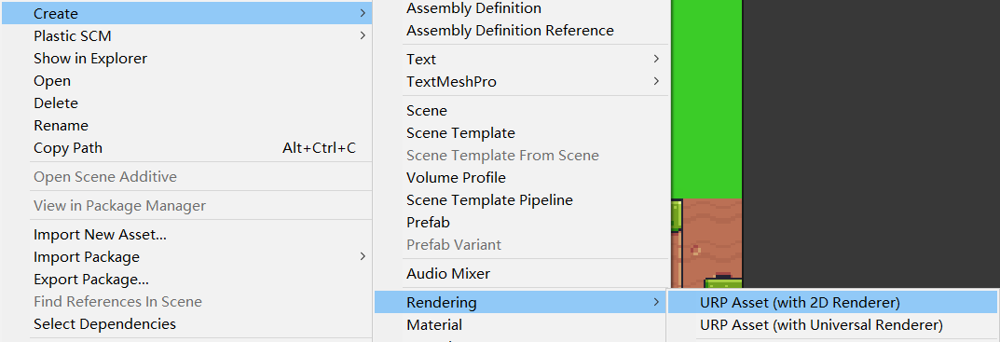
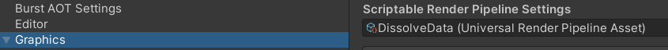
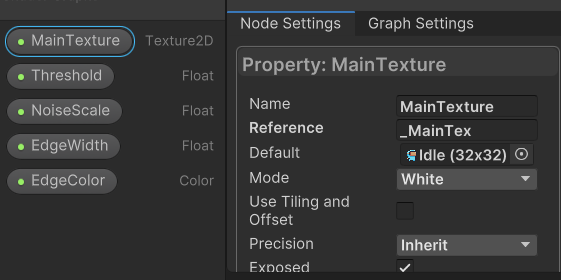
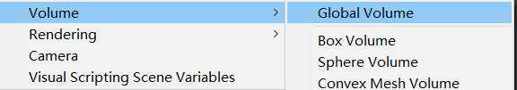
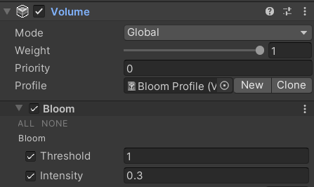
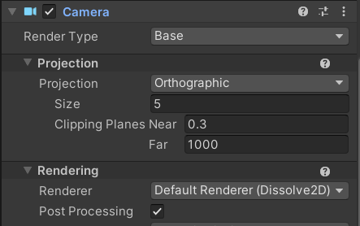
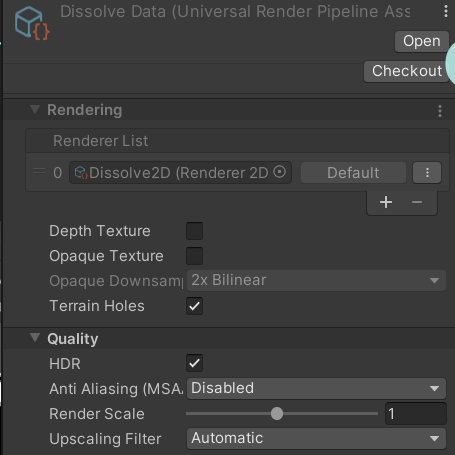

[toc]

# 0. 序言

在之前的教程中，初次了解ShaderGraph也是学的一个溶解效果。

在2D中，也可以创建2D的ShaderGraph。注意，请使用URP项目，Sprite的材质可以接受光照。

# 1. 项目设置

URP项目默认需要设置渲染资源

需要注意的是，需要创建一个2D渲染资源和一个2D渲染器

并在Project Setting中设置Graph资源

这些资源可以设置阴影，质量，HDR等。是决定渲染阶段的行为。

# 2. ShaderGraph实现溶解效果

创建Sprite Unlit Shader的ShaderGraph，关键的实现逻辑是将噪音值**二分为0和1**。

0是溶解，1是未溶解。实现二分的依靠**Step节点**，它的作用是将低于阀门的值变为1；高于的值为0。

*注意事项：*

1. SpriteRenderer的作用是将精灵作为**_MainTex**传入给材质使用，所以在ShaderGraph中记得创建一个\_MainTex引用的参数；

1. 对于灰度图（只有黑白），在相乘时，使用**单独一个通道**（R,G,B其中一个）即可；
2. Sprite Unlit Shader不支持Emission选项（在Shader Block面板中为灰色），所以请将**HDR颜色作为BaseColor传入**即可。

#  3. 使用后处理Bloom处理emission材质

Emission发光贴图，模拟的是**光从内部发起**的情况。

可以设置它发出实时光，烘焙光或是禁用（不影响其他物品）。

但因为Sprite Unlit不支持Emission，所以只能使用后处理模拟自发光了，事实是后处理确实效果更好。

创建后处理配置

应用Bloom

为了可以开启后处理，需要两点：

1. 在相机勾选后处理选项

1. 在渲染资源中质量栏选择HDR

