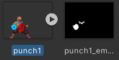
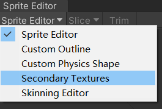
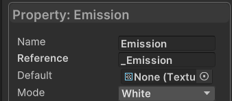
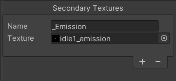
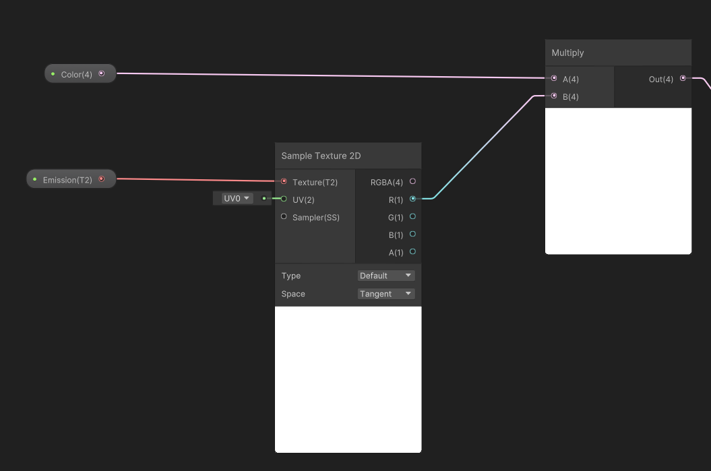
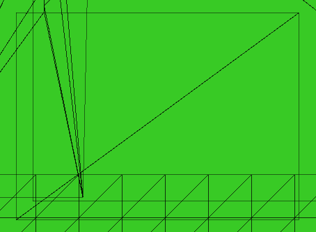
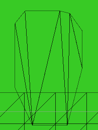

[toc]

# 0. 序言

新知识点是如何使用第二贴图，跟随brackey大神制作发光的攻击效果。

# 1. 制作Emission贴图

需要一个Emission贴图，来告诉精灵哪里应该发光（灰度图，黑是暗；白是光）。

具体做法是将图片加入到ps中，使用铅笔工具，一个一个像素的将图片中要发光的地方画为白色。

可以在ps顶部工具栏中选中选项栏的按颜色选取，来创建选取；再用填充工具就方便一些。右侧是Emission贴图。

# 2. 把Emission贴图作为第二贴图使用

SpriteRenderer中只有一个贴图槽位可以使用，想要使用关联的第二贴图，请在Sprite editor中选择

注意，为了在ShaderGraph中访问第二贴图。请使用**相同的ref名称**。

访问到Emission贴图后，就是利用它修改原本贴图，添加HDR颜色了。具体参考Dissolve笔记内容吧。

后面的则是使用后处理实现Emission发光了。

# 3. Mesh Type和Pixel Per Unit参数

在精灵Inspector中，MeshType和PixelPerUnit参数的意义是

MeshType：**决定精灵的显示范围**，两种模式Rect和Tight

Rect模式

Tight模式

记住只有在范围内，才可以显示。超出部分会被隐藏。

PixelPerUnit：对于此精灵，**Unity世界中一个单元格是多少像素**。记住精灵的像素和Unity世界单元本身是不变。变的是精灵和单元之间的关系。

比如，64x64精灵在32像素上则占据2x2的单元；在64像素上只占一个单元。