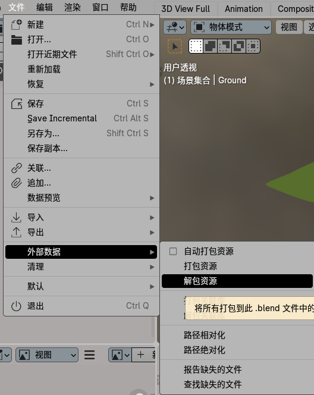
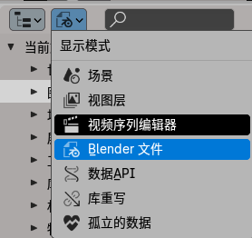

[toc]

# 1. 模型导入问题

​	blender文件包含了模型的**材质和贴图**。就像c++程序链接dll一样。在本地时，多个项目均使用链接，可以节省硬盘空间；但移植到其它计算机上时，必须**创建dll副本**。

​	**打包的含义就是如此，将零散的资源打包到一个文件中，方便移交给其它人**

​	操作是

在将blender导入到unity中时，可能会出现**贴图缺失问题**。并且**解包失败（网上没找到解决方法）**。可以选择导出fbx获取贴图和材质。

另外可以在右上角中查看blender的内容组成

